# Qt Birthday Gift App
A Qt 6/ QML desktop application originally built as a personalized birthday gift and later adapted into a public portfolio project.

## Background
This application was originally created as a personalized birthday gift for my best friend.
The original version contains private photos, videos, music, messages and personalized interactions, and remains in a private repository.
This public version has been prepared for portfolio purposes. All private or identifying content has been replaced with generic placeholder assets while preserving the application's architecture, features and implementation.

Photos of the friend have been replaced by Cats.
A video has been replaced by a Cat. 
The icon has been replaced by a butterfly. 
The songs used have been replaced by generic royalty free music.
Her name has been stripped of all but the starting letter. It's now an app for M_____

## Features

- Built using Qt 6 (QML + C++)
- Multi-screen desktop application
- Centralized StackView-based navigation
- Reusable QML components
- Lazy loading using Loader
- Animated transitions
- Randomized photo gallery
- Local music playback
- Local video playback
- Responsive layouts
- Resource management using Qt Resource System (QRC)

## Screenshots

### Landing Screen
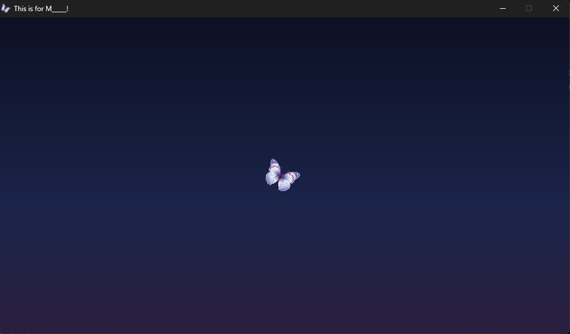

### Passcode Popup
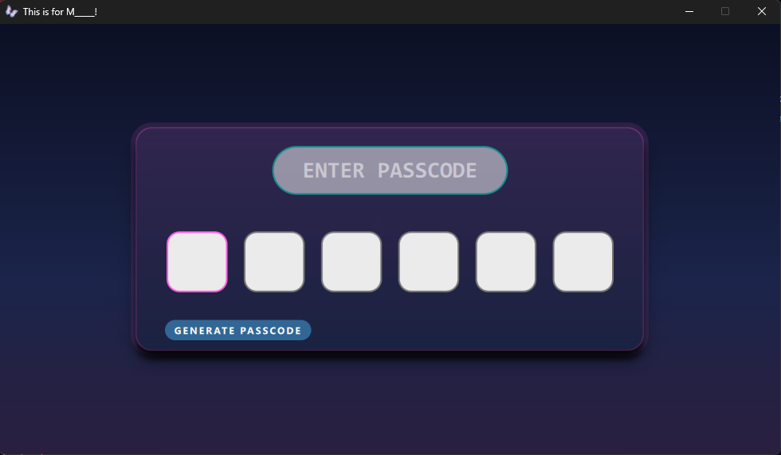

### Menu Screen
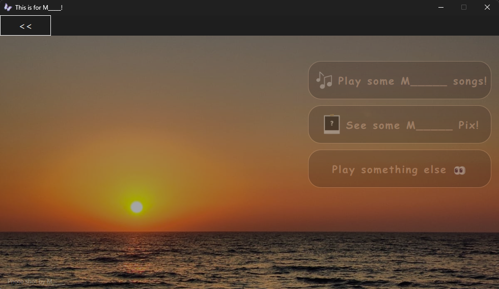

### Music Player
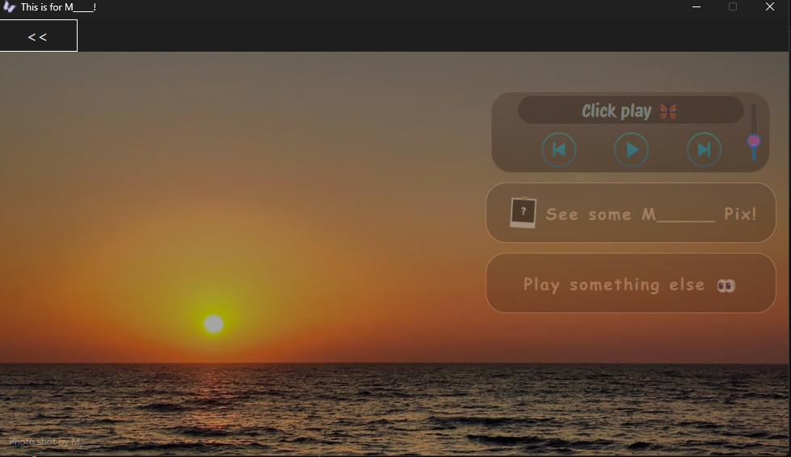

### Pictures Tab
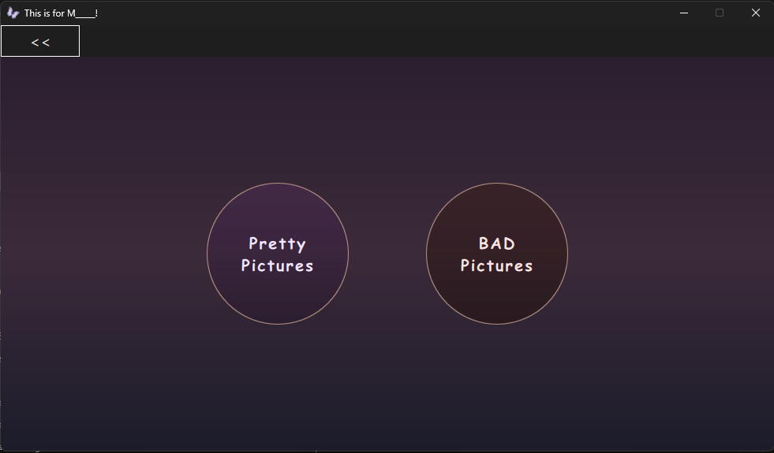

## Progress Bar
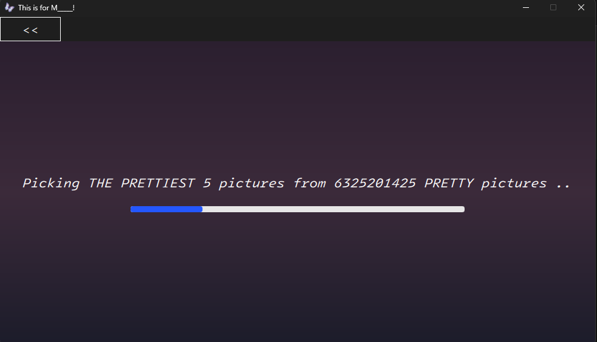
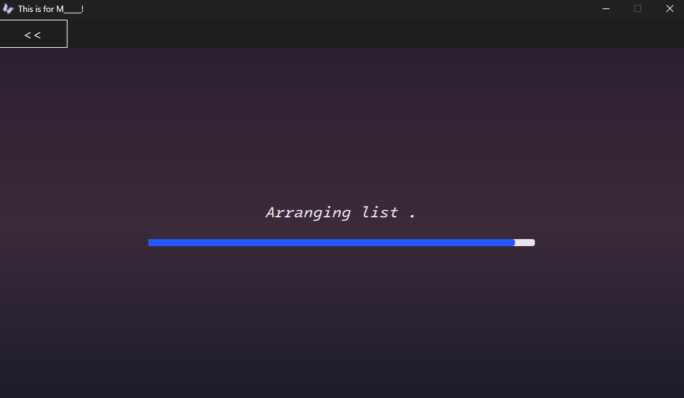
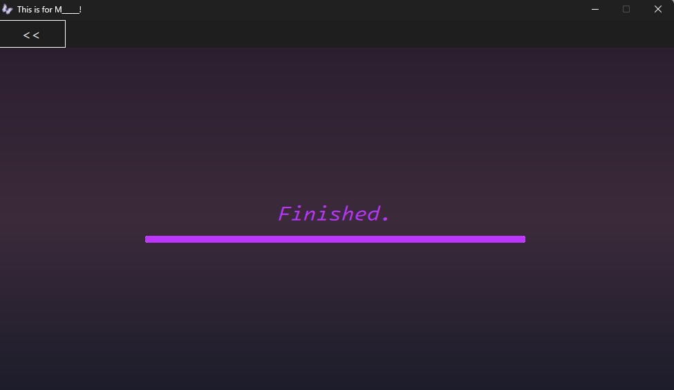
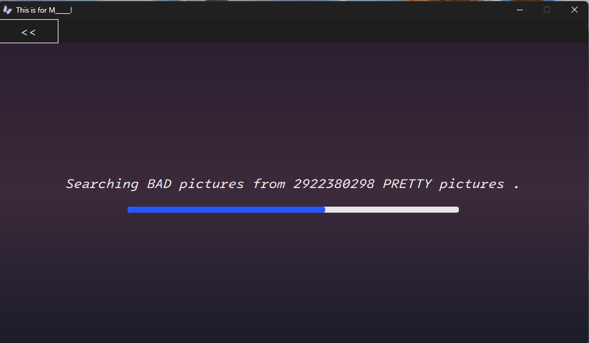
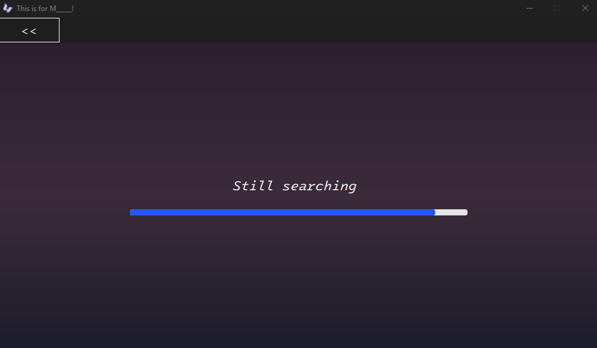
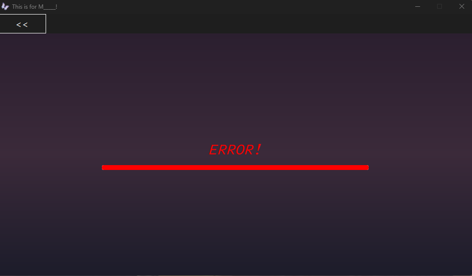

## Pretty pictures

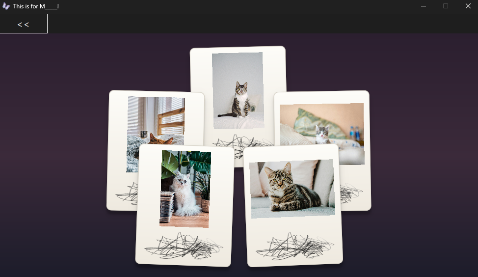
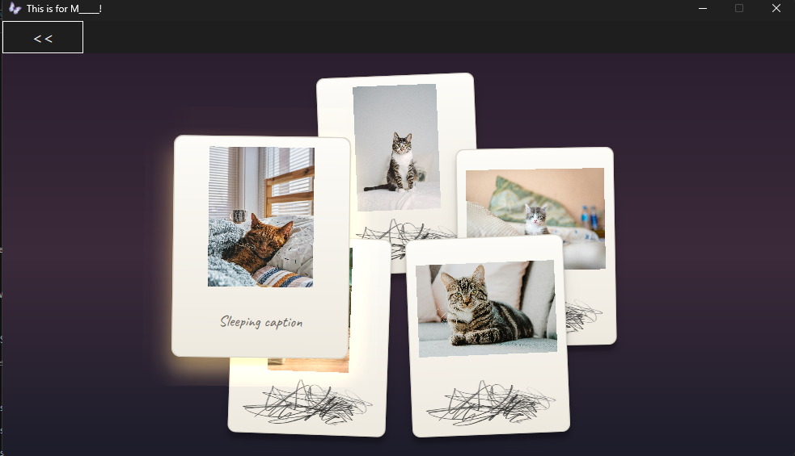

## Bad Pictures
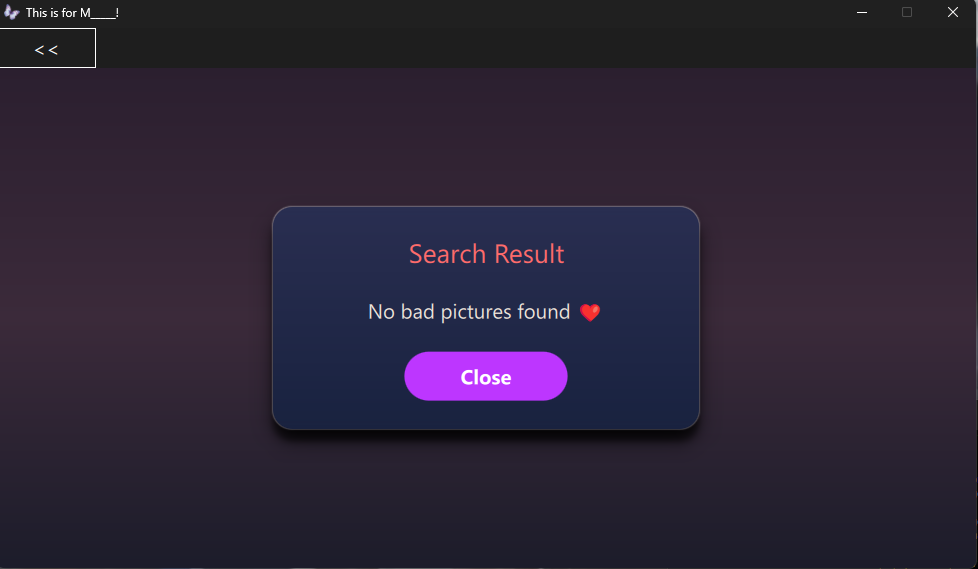

## Video Player

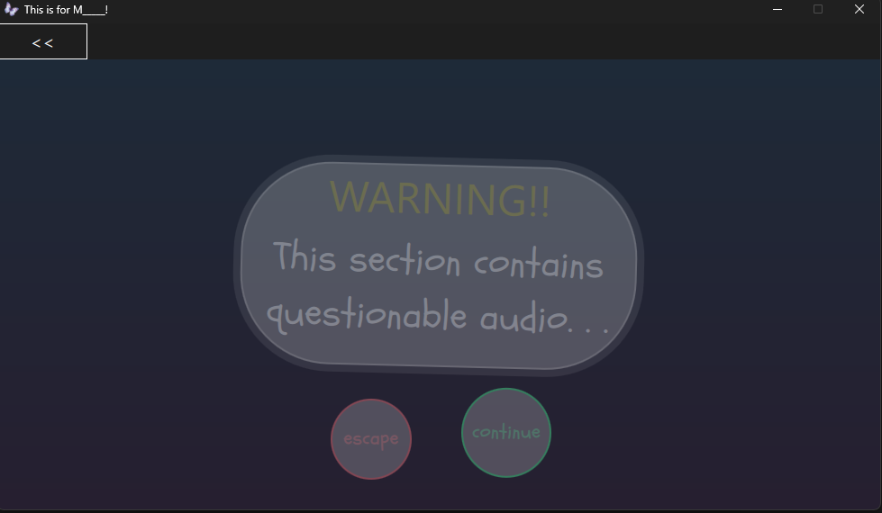
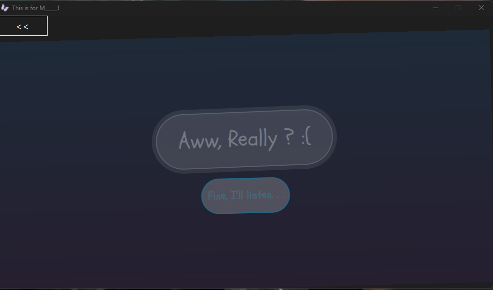

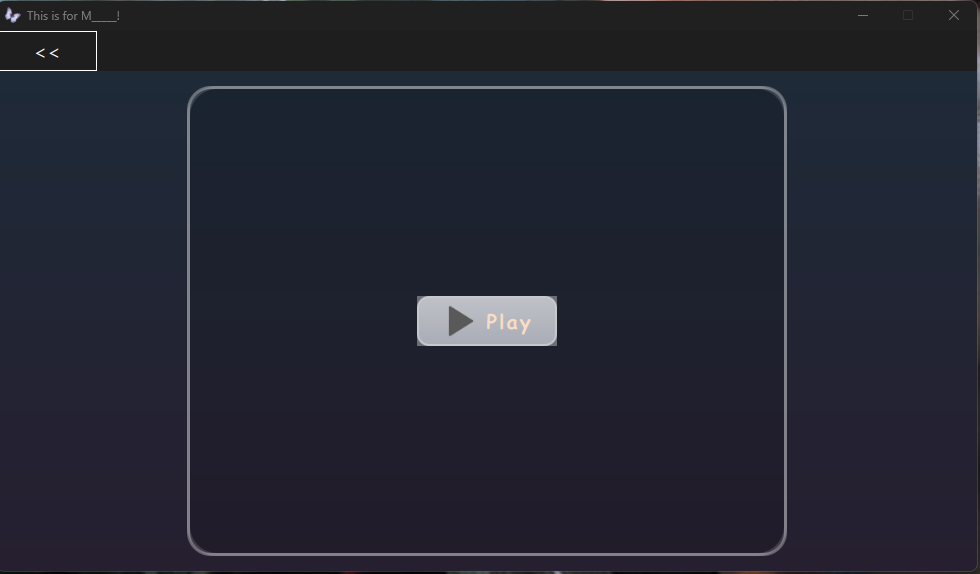
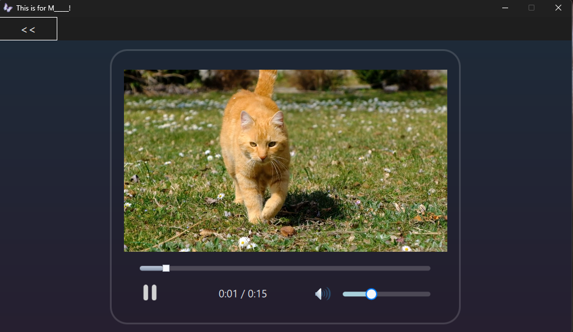

